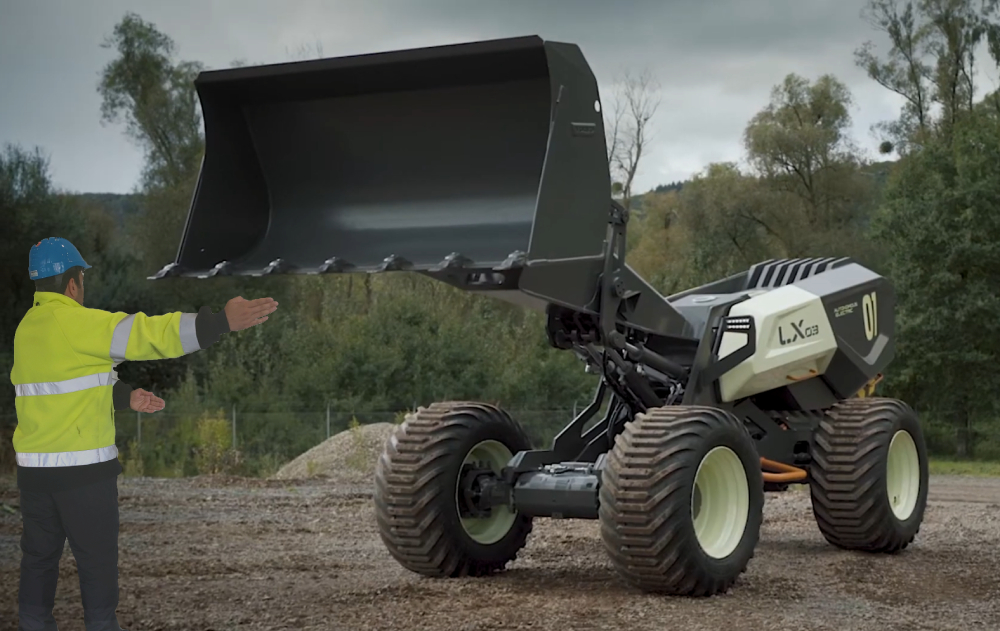

# VolvoConstScene_HAR_SFU
Repository for the paper ["Language Supervised Human Action Recognition with Salient Fusion: Construction Worker Action Recognition as a Use-Case"](https://arxiv.org/pdf/2410.01962) 

# Prerequisites

- Python >= 3.6
- PyTorch >= 1.1.0
- PyYAML, tqdm, tensorboardX

- We provide the dependency file of our experimental environment, you can install all dependencies by creating a new anaconda virtual environment and running `pip install -r requirements.txt ` and `pip install -r requirements2.txt `

pip install torch==1.12.1+cu116 torchvision==0.13.1+cu116 torchaudio==0.12.1 --extra-index-url https://download.pytorch.org/whl/cu116

# Data Preparation

You can download NTU and NTU120 datasets from [NTU](https://rose1.ntu.edu.sg/dataset/actionRecognition/) and follow [CTR-GCN](https://github.com/Uason-Chen/CTR-GCN) for data preparation.
Also, NTU and NTU120 cropped images are provided here:

[NTU](https://vault.sfu.ca/index.php/s/GqQ2rDqhbpHVizk) and [NTU120](https://vault.sfu.ca/index.php/s/Qlth4RBN7CkSf3x)

VolvoConstAct dataset link: [Dataset](https://vault.sfu.ca/index.php/s/TsY56IcvQ1hR6F2)

## Train

For NTU60:

python main\_train\_ntu.py

For NTU120:

python main\_train\ntu120.py

For ConsAct:

python main\_train\_volvo.py

## Load Pretrained

python main\_train\_volvo.py --load_pretrained True --pretrained_address path/to/address
